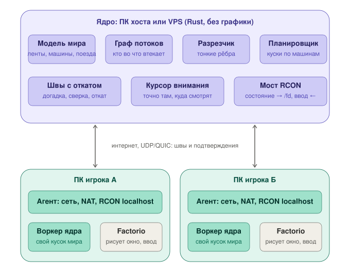

# Архитектура

Зачем вообще обходной путь, рассказано в [why.md](why.md). Здесь описано, как система устроена.
Решения приняты 09.10.2026 по результатам замеров из [bench/RESULTS.md](../bench/RESULTS.md).

## Роли

| кто | где | что делает |
|---|---|---|
| **Ядро** | ПК хоста или VPS | Владеет правдой о мире. Режет мир на куски и раздаёт их машинам, сшивает швы, хранит сейв. Своих воркеров может и не держать: на дешёвом VPS ядро только раздаёт работу. |
| **Воркер ядра** | машина игрока (и/или ядра) | Тот же Rust-код, что и в ядре, но считает только свой кусок мира. Обычно это кусок под курсором внимания своего игрока. |
| **Агент** | машина игрока | Держит связь с ядром (прямое подключение → пробивка NAT → ретранслятор) и говорит с Factorio по RCON только на localhost. |
| **Factorio + мод** | машина игрока | Только рендер: рисует окно и отдаёт действия игрока. Вне окна всё заморожено или пусто. |

Воркеры игроков напрямую друг с другом не связываются: в первой версии все швы идут через ядро.

## Семь частей ядра

1. **Модель мира.** Своя реализация механики Factorio: ленты, манипуляторы, сундуки, сборщики,
   а дальше жидкости, электросеть, логистика, поезда.
2. **Граф потоков** — кто во что втекает. На нём держится разрез.
3. **Разрезчик.** Режет граф по самым тонким рёбрам в двух измерениях: по пространству (поезда,
   дроны, редкие связи) и по подсистемам (жидкости, ленты, энергия, логистика). Второе измерение
   нужно для спагетти-баз.
4. **Планировщик.** Тяжёлые куски отдаёт мощным машинам, лёгкие — слабым. Кусок под курсором
   внимания игрока планировщик отдаёт машине этого же игрока.
5. **Швы с откатом** — см. «Модель времени» ниже.
6. **Курсор внимания.** Точно и быстро считается не район вокруг тела игрока, а то место, куда
   игрок смотрит и куда шлёт команды: карта, remote view, призраки для роботов. В Factorio 2.0 мод
   видит его напрямую: `player.position` — это камера, а `player.physical_position` — тело.
7. **Мост RCON.** Переводит подтверждённое состояние куска в операции `/fd` для окна клиента
   и забирает оттуда действия игрока.

## Модель времени: оптимистичная, с откатом

- Кусок считает вперёд на догадке о входах («поток такой же, как был»). Он хранит снимки и журнал
  входов. Если пришёл настоящий вход и он не совпал с догадкой, кусок откатывается к тику
  расхождения и пересчитывает. Свои выходы, отправленные после этого тика, он отзывает, поэтому
  соседи тоже откатываются.
- **K** — предел, на сколько тиков кусок может уйти вперёд без подтверждения. Это настройка.
  При K = 0 откатов нет вовсе: кусок просто ждёт входов (консервативный режим).
- **Подтверждённый тик** — это минимум по всем кускам. Ниже него откатов не бывает, поэтому
  историю старше него можно выбрасывать. Клиенту показывается только подтверждённое состояние.
- **Инертность потоков — это запас шва.** Предмет проходит тайл ленты за 32, 16, ~11 и 8 тиков
  (обычная, быстрая, экспресс и турбо лента). Задержка сети — около 6 тиков обычно, 13 по p95
  и 22 в худшем замере. Если разрезать ленту хотя бы за 4 тайла до первого потребителя, откатов
  в прямом направлении почти не будет. Критерий для разрезчика: запас шва в тиках должен быть
  не меньше двух задержек сети.
- **Где запаса нет.** Первое — подпор: лента стоит, и это передаётся назад по ленте. Его лечит
  виртуальная очередь на шве. Второе — электросеть: она общая и мгновенная. Её баланс считаем
  по спросу прошлого тика.
- **Клиент откатываться не умеет**: сохранение и загрузка в Factorio занимают секунды. Поэтому
  клиент видит подтверждённое состояние с задержкой примерно 6–13 тиков. Свои действия игрок видит
  сразу, а ядро их потом подтверждает или поправляет.

Что это требует от модели мира:

- **Состояние куска — плоские данные**: массивы и индексы, без указателей. Тогда снимок — это
  просто копия памяти.
- **Шаг детерминирован на любой машине**: в состоянии нет float, только целые числа
  с фиксированной точкой. Позиции хранятся в 1/256 тайла, как у самой Factorio. В этих единицах
  скорости лент целые: 8, 16, 24 и 32 за тик.

## Окно клиента

- Factorio у игрока считает только окно: экран плюс запас. Окно следует за курсором внимания.
- Ядро шлёт только то, что пересекает край окна («на ленту №17 у левого края въехала плита»).
  Дальше предмет везёт движок Factorio, а то, что уехало за край, мод удаляет.
- Машины, манипуляторы, печи и лаборатории вне окна заморожены (`disabled_by_script`). Ленты
  заморозить нельзя, поэтому вне окна они пустые, а их содержимое знает ядро.
- Периодически мод отдаёт сводку окна. Если она расходится с ядром, поправляется только та
  линия, где расхождение.

Замеры для этой схемы: окно 64×36 на мегабазе 10k SPM — это около 700 сущностей и 16–24 предмета
за тик через край. Factorio клиента в таком режиме выдаёт 178 UPS вместо 56, когда считает
всю базу.

## Где живёт ядро

Где стоит ядро, ему не важно: и на ПК хоста, и на VPS это процесс без графики, к которому
подключаются агенты.

- **ПК хоста.** Бесплатно. Если хост играет, швы до его машины локальные. Но нужна пробивка NAT
  или ретранслятор, а когда хост выключает ПК, мир останавливается.
- **VPS.** Белый IP, поэтому ступени NAT не нужны. Работает круглосуточно. Сам VPS считать
  мегабазу не будет: куски без машин он ставит на паузу или считает упрощённо, потоками
  в штуках в секунду.

## Правило против утопания

**То, что ядро ещё не моделирует, считает сама Factorio** (клиент в окне или Factorio без окна
у хоста), а ядро только переносит результат. Порядок такой: ленты, сундуки, манипуляторы →
сборщики, повороты лент, боковая загрузка → дальше по подсистемам. Бой, кусаки, загрязнение
и поезда идут позже или остаются за Factorio.

## План

| этап | что | что доказывает |
|---|---|---|
| M0 | модель лент, сундуков и манипуляторов; снимок и откат; сверка с игрой | модель совпадает с движком потиково |
| M0.5 | сборщики, повороты, боковая загрузка | то же для типовой цепочки |
| M1 | два куска в двух процессах, швы с откатом, ручка K | разрез даёт байт в байт тот же мир, что и без разреза |
| M2 | куски на разных машинах | откаты на реальной задержке сети |
| M3 | мост RCON и окно клиента за курсором внимания | игрок видит мир ядра без прыжков предметов |
| M4 | граф, разрезчик, планировщик, перенос куска на лету | скорость растёт с числом машин до измеримого потолка |
| M5 | несколько игроков: куклы, сейв, восстановление | два игрока в одном мире |
| M6 | UDP/QUIC, ступени NAT, ретранслятор | подключение из-за симметричного NAT без настройки |
